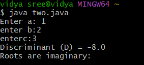

# java-lab-cse-g-o5ef1b
experiment-1b
## EXPERIMENT-1b 
# display roots of the quadratic equation 
1source code: 
JAVA 

```
import java.util.Scanner;

 class Two {
    public static void main(String[] args) {
        Scanner sc = new Scanner(System.in);

           System.out.print("Enter a: ");
double a = sc.nextDouble();
System.out.print("enter b:");
double b = sc . nextDouble();
System.out.print("enterc:");
double c = sc.nextDouble();
double D =b*b - 4*a*c;
        System.out.println("Discriminant (D) = " + D);
       if (D > 0) {

            double x1 = (-b + Math.sqrt(D)) / (2 * a);
            double x2 = (-b - Math.sqrt(D)) / (2 * a);
            System.out.println("Nature: Two real and distinct roots.");
            System.out.println("Roots: x1 = " + x1 + ", x2 = " + x2);
        }
        else if (D == 0) {

            double x = -b / (2 * a);
            System.out.println("Nature: Two real and equal roots.");
            System.out.println("Root: x = " + x);
        }
        else {
                  System.out.println("Roots are imaginary:");     }

        sc.close();
    }
}
```
# OUTPUT: 

